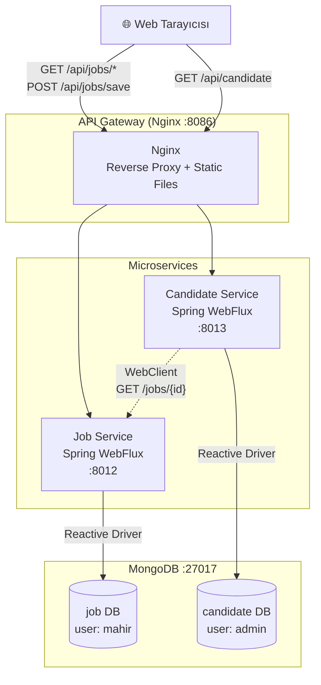

# Microservices Job Portal

Reactive mikroservis mimarisi ile geliştirilmiş bir İş İlanları ve Aday Yönetim sistemi. Nginx API Gateway üzerinden servisler haberleşir.

## 🏗 Mimari



## 📂 Proje Yapısı

```
├── api-gateway/          # Nginx config, frontend HTML/JS, docker-compose
│   ├── conf/nginx.conf
│   ├── html/index.html
│   └── docker-compose.yml
├── job-service/          # İş ilanları servisi (Spring WebFlux + MongoDB)
│   ├── src/
│   ├── Dockerfile
│   └── pom.xml
├── candidate-service/    # Aday yönetim servisi (Spring WebFlux + MongoDB)
│   ├── src/
│   ├── Dockerfile
│   └── pom.xml
└── README.md
```

## 🛠 Teknolojiler
- **Java 23** + **Spring Boot 3 (WebFlux)**
- **MongoDB** (Reactive)
- **Nginx** (API Gateway & Reverse Proxy)
- **Docker & Docker Compose**
- **Bootstrap 4** (Frontend)

## 🚀 Çalıştırma

```bash
cd api-gateway
docker-compose up -d --build
```

Tarayıcıdan → **http://localhost:8086**

## 📡 API Endpoints

| Method | URL | Açıklama |
|--------|-----|----------|
| GET | `/api/jobs/all` | Tüm iş ilanlarını listele |
| POST | `/api/jobs/save` | Yeni iş ilanı ekle |
| GET | `/api/candidate` | Tüm adayları listele |
