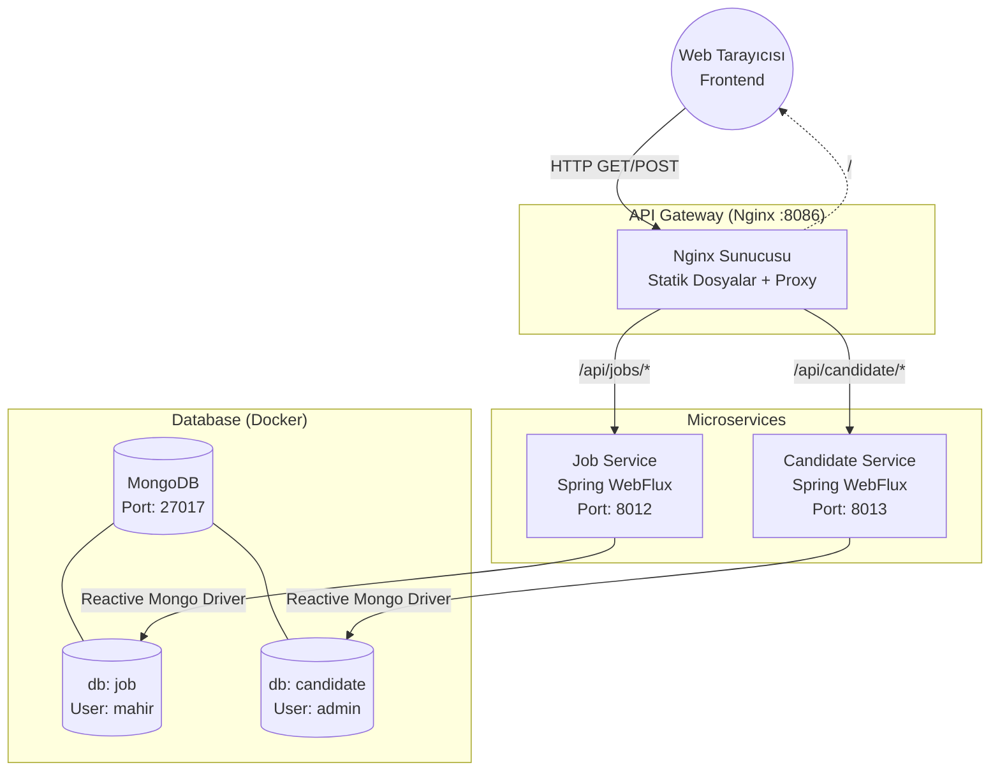

# Microservices Job Portal Architecture

Bu proje, Spring Boot WebFlux ile geliştirilmiş, arka tarafta MongoDB kullanan ve önünde API Gateway olarak Nginx bulunduran reaktif bir mikroservis mimarisidir.

## 🚀 Proje Bileşenleri

- **API Gateway (Nginx):** Gelen tüm HTTP isteklerini karşılar ve arkadaki servislere yönlendirir (Reverse Proxy). Ayrıca statik frontend dosyalarını (HTML/JS) barındırır. 
- **Job Service:** İş ilanlarını yöneten reaktif mikroservis.
- **Candidate Service:** Adayların (iş arayanların) bilgilerini yöneten reaktif mikroservis.
- **MongoDB:** Tüm servislerin ortak olarak bağlandığı, ancak farklı yetkilerle (farklı veritabanları ve kullanıcılar) işlemlerini gerçekleştirdikleri NoSQL veritabanı.

## 🏗 Mimari Şema

Sistemin çalışma mantığı ve servisler arası iletişim mimarisi aşağıdaki gibidir:



## 🛠 Kullanılan Teknolojiler
- **Java 23** & **Spring Boot 3 (WebFlux)**
- **MongoDB** (Reactive Data)
- **Nginx** (API Gateway & Web Server)
- **Docker & Docker Compose**
- **JavaScript & Bootstrap** (Frontend)

## 🐳 Nasıl Çalıştırılır?

Projenin tamamı Docker Compose ile otomatik olarak ayağa kalkacak şekilde tasarlanmıştır.

1. API Gateway dizinine girin:
   ```bash
   cd api-gateway
   ```
2. Sistemdeki tüm konteynerleri (Nginx, Job-Service x3, Candidate-Service, MongoDB) başlatın:
   ```bash
   docker-compose up -d --build
   ```
3. Tarayıcınızdan **http://localhost:8086** adresine girerek frontend arayüzüne ulaşabilirsiniz.
